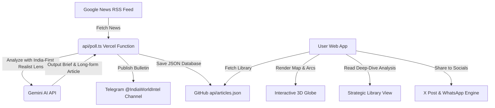

# Walkthrough: Geopolitical Dashboard Evolution

This document summarizes the changes, new features, and technical architecture implemented in the **Geopolitical Dashboard** codebase.

---

## 1. Architecture & Components Overview

The dashboard has evolved from a basic 3D globe visualization into an active intelligence center, integrating automated live feeds, AI-driven strategic commentary, a realist-perspective analysis library, and social sharing tools.



---

## 2. Detailed Technical Changes

### 🛡️ UI & Frontend Enhancements

#### 1. Interactive 3D Globe & Mobile Optimization (`src/components/Dashboard.tsx`)
*   **Connection Arcs**: Rendered dynamic connection lines (`arcsData`) on the 3D globe showing geostrategic relationships between players.
*   **Mobile Responsive Layout**: Implemented mobile tabs (**Map**, **News**, **Library**) with a fixed bottom switcher, resolving layout squishing on mobile dimensions.
*   **Active Feed Notification**: Added a high-tech "📡 GLOBE FEED ACTIVE" label overlay.
*   **Telegram Growth Button**: Integrated a floating pulse button pointing to `https://t.me/IndiaWorldIntel` to drive user engagement.

#### 2. Strategic Library & Reader (`src/components/ArticlesView.tsx`) [NEW]
*   **Thematic Highlighting**: Color-codes article subsections dynamically using custom emoji/accent colors (e.g., Red 🧠 for **Strategic**, Gold ⚡ for **Economic/Resource**, Teal 👁️ for **Path Ahead**).
*   **Article Search**: Interactive real-time search filtering title and descriptions.
*   **Social Sharing Integration**: One-click sharing buttons configured for X (Twitter) and WhatsApp.

#### 3. Category Categorization & Filtering (`src/components/SidePanel.tsx`)
*   **Category Pills**: Added interactive filters for categorized signals (Security 🛡️, Energy ⚡, Tech 💻, Diplomacy 🕊️).
*   **Focus Notices**: Replaced error alerts with clean informative notifications when signals cluster in a specific geostrategic hotspot.

#### 4. Premium Cards & Viral Sharing Hooks (`src/components/SignalCard.tsx`)
*   **Category-Specific Themes**: Card headers adjust color palettes based on signal category (e.g., Security uses crimson, Tech uses cyan).
*   **Enhanced X Sharing Engine**: Automatically structures tweet content under 280 characters with custom status prefixes based on risk scores (e.g., `🔴 CRITICAL ALERT:` or `🔍 STRATEGIC BRIEF:`).
*   **Read Full Report**: Direct link button to open the original news source.

---

## 3. Serverless API Integrations (`api/` Directory)

#### 1. Live Intelligence Sweep (`api/poll.ts`)
*   Fetches the latest geopolitics articles from Google News RSS.
*   Triggers **Gemini 3.5 Flash** to draft the realist analysis from the perspective of an analyst (Navroop Singh).
*   Uses persistent state files (`api/last_posted.txt`) and GitHub API integration to prevent duplicate broadcasts.
*   Saves the resulting long-form article to the library database (`api/articles.json`).
*   Broadcasts formatted HTML alerts with inline buttons (e.g., *Share on X*, *View Full Report*) directly to the channel.

#### 2. Automated Brief Digest (`api/digest.ts`)
*   Compiles top news items into a single geostrategic digest twice a day (Morning/Evening based on Indian Standard Time).
*   Requests a structured HTML digest from Gemini and posts it in HTML parse mode.

#### 3. Broadcast Approval Endpoint (`api/approve.ts`)
*   Provides an endpoint to verify, approve, and push draft briefs live to the Telegram channel.

#### 4. Verification Endpoint (`api/test-tel.ts`)
*   Simple health-check endpoint to verify Telegram Bot credentials and chat connection.

---

## 4. Metadata, SEO, & Deployment Configurations

*   **SEO Meta Optimization (`index.html`)**: Added Open Graph tags, viewport optimization, and keyword metadata targeting national security, conflicts, and strategic intelligence.
*   **Vercel Analytics (`src/main.tsx`, `package.json`)**: Added `@vercel/analytics` to track dashboard traffic and library engagement.
*   **Package Dependencies**: Added `twitter-api-v2` for automated social scheduling support.

---

## 5. Verification & Setup Instructions

### Environment Configuration
Ensure your `.env` file contains the following keys:
```env
TELEGRAM_TOKEN=your_telegram_bot_token
TELEGRAM_CHAT_ID=your_telegram_chat_id
GEMINI_API_KEY=your_gemini_api_key
Github=your_github_personal_access_token
BLUESKY_HANDLE=your_bluesky_handle.bsky.social
BLUESKY_APP_PASSWORD=your_bluesky_app_password
THREADS_ACCESS_TOKEN=your_threads_long_lived_token
THREADS_USER_ID=your_threads_numeric_user_id
```

### Local Dev Verification
To start the Vite server locally, run:
```bash
npm run dev
```
To build and check production builds locally:
```bash
npm run build
```
